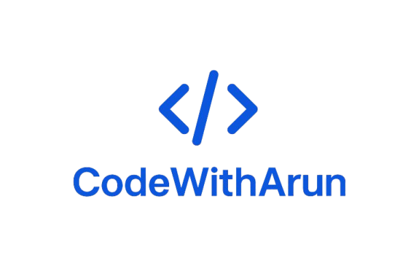

<!-- ============================
     CodeWithArun — GitHub README
     Dark-first premium template
     Copy this into README.md
   ============================ -->

  

  
  &nbsp;
  
  &nbsp;
  

---

## 👋 About Me

I’m **Arunkumar** — a passionate Full Stack Developer building modern, accessible web experiences under my brand **CodeWithArun**.

- 🔭 Currently building AI-driven developer tools and polished web UIs  
- 🌱 Learning advanced ML integration & performant React rendering  
- 💼 Open to collaborations and roles in frontend / full-stack / AI tooling  
- ⚡ Core: **JavaScript**, **React**, **Next.js**, **Node.js**

---

## 🔖 Branded Badges (SVG)

  <!-- Inline data SVGs or hosted images work best — below are badge image links -->
  
  
  

---

## 🛠️ Tech Stack

**Frontend:** React, Next.js, Tailwind CSS, TypeScript, JavaScript  
**Backend:** Node.js, Express, REST APIs  
**Databases:** MongoDB, MySQL  
**Tools:** Git, GitHub, VS Code, Postman, Figma

  

---

## 🔭 What I'm Working On (Live-ish)

- **AI Code Reviewer** — automated code analysis & suggestions (React18 , Typecript)  
  _Status: Completed._
- **Virtual Try-On (OpenCV)** — prototype for real-time overlay and gesture controls.  
  _Status: Research & demos._

---

## 📦 Featured Projects

### 🔸 AI Code Reviewer
- AI-powered tool that analyzes code and provides suggestions, issues, and a quality score.  
- **Tech:** React 18, TypeScript, Tailwind, Lucide Icons, Class Variance Authority  
- **Demo:** *https://ai-codes-reviewer.netlify.app/)* 

### 🔸 Portfolio — CodeWithArun
- Personal site showcasing projects and contact.  
- **Tech:** Raect.js, Tailwind CSS, Typescript, Javascript  
- **Live:** *(https://arun-developer-portfolio.vercel.app/)*

### 🔸 Virtual Try-On App
- Real-time T-shirt overlay using OpenCV (Python & Tkinter).  

---

## 📈 GitHub & Contribution Stats

  
  

  

---

## 🗺️ Roadmap — Next 6 months

- Q1 — Improve AI Code Reviewer scoring & add language-specific rules  
- Q2 — Launch improved Portfolio (dark-mode-first, faster load, i18n)  
- Q3 — Build a set of open-source dev utilities under **CodeWithArun**  
- Q4 — Learn and integrate ML/LLM-based code transformation tools

---

## 📫 Contact

- **Portfolio:** *(https://arun-developer-portfolio.vercel.app/)*  
- **LinkedIn:** *(https://www.linkedin.com/in/arunkumar-s-25b335235/)*  
- **Email:** *(arunkumarame04@gmail.com)*  
- **Brand:** CodeWithArun

---

  ⭐ If you like my work, please give my repos a star & follow for updates!

